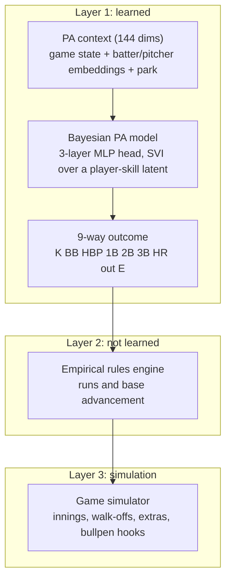
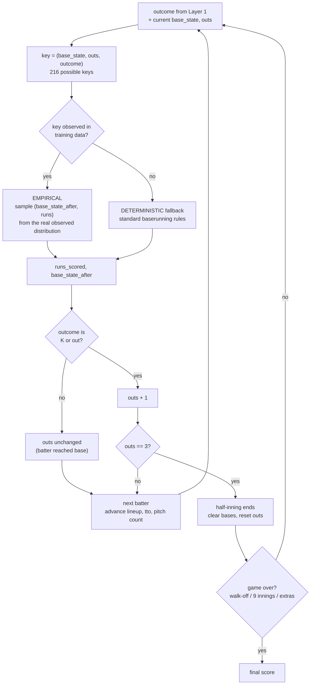

# DiamondWorld

A plate-appearance-level generative model of baseball, plus an empirical rules engine and
a full game simulator. It plays out complete games one plate appearance at a time,
conditioned on lineup, starter, bullpen, park and game state.

The point is not to project player rates better than the projection systems. It is to
build the generative object that answers questions a projection system structurally
cannot: counterfactual what-ifs, lineup construction, correlated tail risk, and win
probability with honest uncertainty.

- Full experimental record and every negative result: [RESULTS.md](RESULTS.md)
- Reviewer-reproducible protocol, data as-of dates, script map: [REPRODUCE.md](REPRODUCE.md)
- Paper draft: [`paper/diamondworld.tex`](paper/diamondworld.tex)

## Architecture

Three layers, and the central design decision is how little the neural network is allowed
to do.



The network predicts **only** the 9-way outcome. Runs scored and the resulting base state
come from an empirical lookup, not a neural head. Versions v1 to v5 let neural heads
sample runs and bases directly; the per-PA inconsistency compounded across a game and blew
up game-level variance. Handing that job to a table is what made v6 the first version
whose run rate matched reality.

## The rules system

Everything downstream of the outcome is arithmetic plus observed baserunning, keyed on
`(base_state, outs, outcome)`. `base_state` is a 3-bit mask (bit0 = runner on 1B, bit1 =
2B, bit2 = 3B), giving 8 x 3 x 9 = 216 possible keys.



**Why empirical rather than deterministic.** Given the *real* outcome sequence, the
empirical engine reproduces test-season total runs to **-0.45% bias**. The deterministic
rule undercounts by **-26%**, because real baserunners are more aggressive than the
textbook rule: they score from second on a single, tag up, and take the extra base. The
deterministic path is kept only as a fallback for keys never seen in training.

The consequence is that the entire run-distribution problem reduces to getting the per-PA
outcome right, which is why the project's evaluation focuses there.

Two details worth knowing if you touch this code:

- The outcome class order `["K","BB","HBP","1B","2B","3B","HR","out","E"]` is load-bearing
  and guarded by `tests/test_pa_encoding.py`. A silent index bug here once made the
  sequence models look far worse than they were.
- `EmpiricalEngine.sample(..., u=)` takes an optional uniform for common random numbers,
  so two counterfactual scenarios advance runners identically wherever the play is
  identical and the shared noise cancels in the difference.

## Results

The metric is cross-player rate correlation: how well predicted K / BB / Hit / HR rates
track each batter's actual rates. Per-PA log-likelihood is **saturated** and does not work
as a yardstick here (marginal outcome entropy is 1.495 nats and every model lands at 1.49
to 1.55), so a model can win on NLL while being a worse world model. JEPA is the clean
demonstration: best NLL of anything tried, near-zero player differentiation.

### Model progression

Two evaluation regimes, not directly comparable to each other. v12 to v14 train through
2022 and test on 2023+2024 (434 batters); v15 onward train through 2023 and test on 2024
(382 batters).

All figures below are **corrected** for the index-0 scoring defect found in review; see
[RESULTS.md](RESULTS.md) for what changed and by how much. Earlier v12 to v15 numbers are
left as originally measured and are inflated by the same amount.

| model | change | AVG player-corr |
|---|---|---|
| v6 | outcome-only head + empirical engine | first version matching real run rate |
| v10 | park + fatigue, 50K steps | best marginal run distribution (KL 0.0044) |
| v12 | recency-weighted features | 0.484 (uncorrected) |
| v13 | minibatch-SVI KL-scale fix | 0.556 (uncorrected) |
| v14 | padded-PA likelihood mask | 0.531 (uncorrected) |
| v15 | retrain through 2023 | 0.594 (uncorrected) |
| **v16** | **xBA-style contact quality** | **0.624 (current best, corrected)** |

### Benchmark against real projection systems

Same 2024 test set, same metric.

| system | K% | BB% | Hit% | HR% | AVG |
|---|---|---|---|---|---|
| Steamer | 0.820 | 0.702 | 0.510 | 0.651 | **0.671** |
| Marcel | 0.790 | 0.685 | 0.420 | 0.609 | 0.626 |
| DiamondWorld v16 | 0.792 | 0.651 | 0.445 | 0.610 | 0.624 |

v16 is level with a standard projection baseline and 0.047 below Steamer, with the largest
single gap in hit rate. The Steamer and Marcel rows are unaffected by the scoring defect,
since that comparison keys on real player ids.

### The v17-v21 variant series: ten gated attempts, zero confirmed wins

Every variant is a single lever on v16's exact recipe, gated on a **paired bootstrap
confidence interval** that must exclude zero (`bootstrap_playercorr.py`). A better point
estimate is not sufficient evidence.

| variant | axis | AVG vs v16 | 95% CI | verdict |
|---|---|---|---|---|
| v17a bilinear matchup | architecture | +0.001 | [-0.008, +0.010] | null |
| v17b nested outcome head | architecture | -0.008 | [-0.022, +0.004] | null, **Hit -0.042 confirmed** |
| v18 aggregation loss (L=1) | objective | -0.005 | [-0.016, +0.005] | null |
| v18b aggregation loss (L=4) | objective | -0.013 | [-0.028, +0.002] | null |
| v19c learned prior scale | prior | -0.025 | [-0.039, -0.011] | regression |
| v19d LKJ-correlated prior | prior | -0.012 | [-0.023, +0.000] | null |
| v19w per-season random walk | structure | +0.001 | [-0.014, +0.016] | null, AVG 0.626 |
| v20 per-stat feature shrinkage | features | +0.007 | [-0.005, +0.018] | null, AVG 0.631 |
| v21 v19w + v20 combined | both | +0.015 | [-0.004, +0.032] | null, p=0.130 |
| v21b same recipe, seed 1 | replication | +0.011 | [-0.007, +0.028] | null, p=0.241 |

What this closes. **Architecture**: with the earlier transformer / GRU / LSTM / MLP sweep
all landing near 0.577, six structural interventions have produced zero wins, so the
limitation is not the model's structure. **Objective**: the per-batter aggregation loss is
inert at weight 1 and actively harmful at weight 4, so the null is a real measurement
rather than a too-weak knob. **Prior**: both ways of relaxing the skill prior regress, so
the fixed unit prior is doing real regularisation work.

The nulls are tight, with AVG interval widths of 0.019 to 0.025. The power analysis below
says exactly what that buys: these are measurements of absence for effects of +0.030 and
larger, and inconclusive below about +0.025.

**The one live thread, and what the scoring fix did to it.** v19w and v20 are independent
mechanisms, one changing latent structure and one changing input features, and both moved
hit rate after that stat had resisted every previous lever. Neither passed alone. v21
combines them, and the preregistered additive prediction still lands on corrected numbers:

| | AVG | Hit |
|---|---|---|
| v19w alone | +0.001 | +0.010 |
| v20 alone | +0.007 | +0.016 |
| sum, predicted before running | +0.008 | +0.026 |
| **v21 observed** | **+0.015** | **+0.027** |

Additivity on hit rate survives the correction almost exactly (+0.026 predicted, +0.027
observed), so the two mechanisms really are independent and are still the only levers that
have moved that stat. What does not survive is the magnitude. Before the fix v21 read
+0.025 AVG at p = 0.054, a near-miss; corrected it reads **+0.015 at p = 0.130**, and the
strikeout component that carried much of the apparent gain falls from +0.020 to **+0.000**.
Roughly 40% of the effect was the index-0 artifact. The second seed, v21b, tells the same
story at +0.011.

**v16 remains the incumbent**, and this is the tenth gated variant without a confirmed win.
The honest reading is now weaker than it was a week ago: not a near-miss awaiting one more
piece of evidence, but a hit-rate effect of perhaps +0.027 sitting inside a series whose
AVG signal is mostly gone.

More seeds cannot settle it, and neither can more compute. Seeds resample the model while
the same 382 batters stay fixed, so the paired interval is set by the test set and does not
shrink; and the two runs share that test set, so their p-values cannot be legitimately
pooled. The remedy is independent batters, which means a **2025 test season**.

### The gate is honest, and the whole series was underpowered

Ten rejections invite a question the project had never asked: can this gate detect an
effect of the size these variants produce? `power_playercorr.py` answers it by simulating
the test season under a known ground truth, no GPU involved.

| true AVG delta | +0.000 | +0.010 | +0.015 | +0.020 | +0.025 | +0.030 | +0.040 |
|---|---|---|---|---|---|---|---|
| P(CI excludes zero) | 0.04 | 0.17 | 0.31 | 0.49 | 0.71 | **0.85** | 0.98 |

The false-positive rate at a true delta of zero is 0.044 against a nominal 0.05, so the
paired bootstrap is calibrated and no rejection was a procedural artifact. But the
**minimum detectable effect at 80% power is +0.030 AVG**, and every variant in the series
landed below it. On corrected numbers v21's +0.015 has only **31%** power. So the nulls
above close the +0.030-and-larger band rather than everything, and the series was never in
a position to confirm effects of the size it was producing.

**The ceiling was also wrong.** Observed rates are binomial draws around true rates, which
caps the attainable correlation. Method of moments gives the real bound:

| stat | K | BB | Hit | HR | AVG |
|---|---|---|---|---|---|
| max attainable | 0.929 | 0.852 | **0.691** | 0.794 | **0.816** |
| v16, corrected | 0.792 | 0.651 | 0.445 | 0.610 | 0.624 |

The technique sweep concluded hit rate was luck-limited at 0.39, yet v16 already scores
0.445. The true bound is 0.691, so hit rate has the **largest** headroom of the four stats,
not the smallest, and Steamer's 0.510 sits inside that gap. The old number was a ceiling
over the methods tried, not a property of the data, and it foreclosed the one direction
v19w, v20 and v21 were actually moving. Details in [RESULTS.md](RESULTS.md).

### Other findings

- **Betting: closed, negative.** Five independent approaches agree the moneyline market is
  efficient against this model, including a network trained with closing-line value as its
  loss, which learned a residual of about zero. Totals and runline lose too.
- **Run distribution is the measured win.** Across all 2,376 completed 2024 games the
  simulator's per-game run-total variance is 17.87 against reality's 18.24, with central
  interval coverage 0.54 / 0.82 / 0.90 at nominal 50 / 80 / 90. An independent-Poisson
  model under-covers badly at 0.42 / 0.66 / 0.77.
- **Win probability is calibrated but not sharp.** ECE 0.039 over the full season, but AUC
  0.572 against Log5's 0.617. The contribution is the distribution and the uncertainty
  decomposition, not a better point estimate of who wins.

## Repository layout

```text
diamondworldjax/          the current model line (JAX / NumPyro / Flax)
  model/pa_model.py       PA outcome model, variant flags
  model/embeddings.py     player encoder and skill fusion
  sim/rules_engine.py     empirical + deterministic transition engine
  sim/                    game simulator, bullpen hooks
  scripts/                training, evaluation, analysis
  train/svi.py            SVI loop and variational guides
diamondworld/             earlier PyTorch line and baselines (B0-B5)
paper/                    LaTeX source and figures
tests/                    rules engine, encoding, and model-variant guards
scripts/                  run drivers and pre-flight checks
```

## Running things

Environment and exact pinned versions are in [REPRODUCE.md](REPRODUCE.md).

```bash
# score a checkpoint on the player-corr metric
python -m diamondworldjax.scripts.prod_playercorr --ckpt <ckpt> \
    --recency-halflife 2.0 --skill-mode mean --train-end 2023 \
    --test-seasons 2024 --contact-quality --tag v16

# gate a variant against the incumbent (no GPU needed)
python -m diamondworldjax.scripts.bootstrap_playercorr \
    --rates v16=data/eval2/prod_rates_v16.npz \
    --rates v20=data/eval2/prod_rates_v20.npz \
    --baseline v16 --reps 20000

# tests, including the silent-failure guards
pytest tests/
```

**Before adding a latent to the model, run `scripts/_check_guide_coverage.py`.** A NumPyro
guide that omits a latent site does not raise: the site is drawn from its prior every step
and never learned, producing a run that trains cleanly and reports a plausible number
answering a different question. That bug invalidated two experiments here before it was
caught.


### Training and rollout runtime

PA training and native Bayesian ABCD training default to 16 optimizer updates per
compiled chunk and two prefetched batches/chunks. Use `--update-chunk-size 1`
and `--prefetch-depth 0` to diagnose the unchunked, synchronous path. Chunking
preserves update order, logging/checkpoint boundaries, and per-update nonfinite
checks; PA scheduled sampling continues one update at a time. Custom PA iterators
must reuse the same immutable player-table object to combine updates.

ABCD marginal likelihood reuses differentiable per-head history representations
across integration draws and directly scores fully observed batches. It retains
the same missing-data objective, observation masks, and dropout realization.
Training batches use a bounded preparation queue and a small set of sequence
lengths; only trailing padding is removed, never targets or warm-up context.

Standard PA inference and categorical sampling are fused on device, returning
only sampled outcomes. Recalibration/common-random-number paths retain their
existing sampling behavior; the empirical game-state engine remains on the host.
Bucketed sampling is reproducible, but its fixed-seed draws need not match older
rollout implementations. These changes do not alter checkpoint parameter trees.
